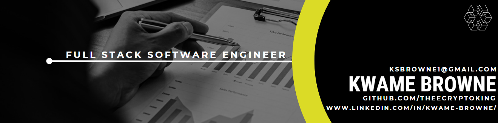

<h3 align="left">:file_folder:Get in Contact With Me:card_index_dividers:</h3>

  
  
 

<h3 align="left">:iphone:Languages & Tools:hammer_and_pick:</h3>

 
<h4>UI/UX Design</h4>

 
<h4>Frontend</h4>

 
<h4>Backend</h4>

  

<h3>✨Current Stats✨</h3>

<!-- <h3 align="left">Current Stats:</h3> -->

<!-- 

 -->

 

<h3 align="center"> :computer: Techincal Projects :desktop_computer:</h3>
<table align="center">
<thead>
  <th>Project</th>
  <th>Description</th>
  <th>Tech stack</th>
  <th>Features</th>
  <th>Repo</th>
  <th>Demo</th>
</thead>
<tbody>
  <tr>
    <td>NBA Stats</td>
    <td>Site to collect cards for your favorite NBA players and hold a favorites collection of their current or past teams. You will be able to hold all of their stats on their Cards. Perfect for any Enthusiast!</td>
    <td><ul><li>Vanilla JS</li><li>Bootstrap CSS</li><li>HTML</li></ul></td>
    <td><ul><li>Full CRUD </li><li>API utilization</li><li>Internal Routing</li></ul></td>
    <td><a href="https://github.com/TheeCryptoKing/NBA-Stats-Elite-" target="_blank">View</a></td>
    <td><a href="https://tangerine-lolly-52e65e.netlify.app">Link</a></td>
  </tr>
  <tr>
    <td>Anime Searcher 3000</td>
    <td>Look up current, popular, past anime of any kind and search nostalgic anime. Favorite the ones you like and create Fanfics of your favorite ones!</td>
    <td><ul><li>React</li><li>Vanilla JS</li><li>BootStrap</li><li>HTML</li></ul></td>
    <td><ul><li>Full CRUD </li><li>APi utilization</li><li>Responsive Design</li><li>Full CRUD Functionality</li></ul></td>
    <td><a href="https://github.com/TheeCryptoKing/Anime-Searcher-3000" target="_blank">View</a></td>
    <td><a href="https://adorable-cannoli-5616dc.netlify.app/" target="_blank">Link</a></td>
  </tr>
  <tr>
    <td>METSYS</td>
    <td>A python command line RPG. Where you must decide the warrior you need to be to defeat this system that is trying to kill you at every turn, FOr some reason this world doesn't feel real and you can't put your tongue on it.</td>
    <td><ul><li>Python</li><li>SQL</li><li>SQLAlchemy</li><li>Flask</li><li>Flask_Restful</li></ul></td>
    <td><ul><li>Full CRUD </li><li>Python RPG, with character selection and battle sequences</li><li>User profile creation, that tracks items and data</li><li>All original created DATA</li></ul></td>
    <td><a href="https://github.com/TheeCryptoKing/METSYS" target="_blank">View</a></td>
    <td><a> N/A </a></td>
  </tr>
  <tr>
    <td>Bold Skin</td>
    <td>Ecommerce Site for conscious and sustainable Men’s HealthCare. Dedicated to saving the planet and helping one product at a time. Using sustainable, non-carogenic, and non-cruelty products to complete our mission. </td>
    <td><ul><li>React</li><li>React Router V6</li><li>React Bootstrap</li><li>Flask</li><li>Flask-Restful</li><li>Flask-SQLAlchemy</li></td>
      <td><ul><li>Full CRUD </li><li>User Creation & Validation</li><li>Fomirk & Yup forms</li><li>Full "Hypothetical" Shopping Functionality</li><li>Onload Animations</li><li>Responsive Design & Custom Original Designed Products</li></ul></td>
      <td><a href="https://github.com/TheeCryptoKing/Bold-Skin/"target="_blank">View</a></td>
      <td><a href="https://bold-skin.vercel.app">View</a></td>
  </tr>
</tbody>
</table>
